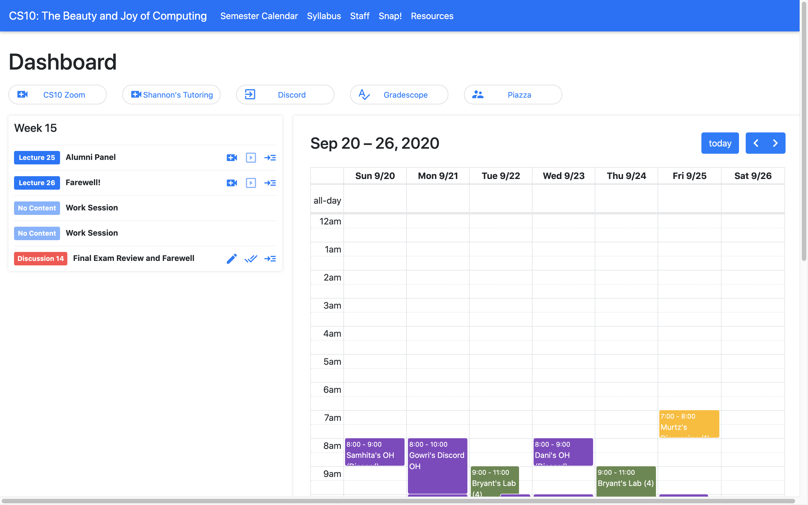

# CS10 React

CS10 React is an upcoming iteration of the CS10.org website, aimed at delivering a simple, clean experience for students while minimizing work for course staff. It features a redesigned interface, an easy to configure interface, and responsive design.

  

You can check out my personal instance [here](https://maxsonyang.github.io/cs10-react/)

## Getting Started

* [For TAs (work in progress)](docs/TA_README.md)
* [For Context (work in progress)](docs/project_background.md)

## Ingredients Used

* Gatsby
* React
* Sass
* Bootstrap 4
* Full Calendar

## Contributing/Using

Currently, I'm working specifically with CS10 to develop this website privately. However, if you'd like to use the source code for your own class, feel free!

## Contact

Should any questions or issues arise in the future, feel free to contact Maxson at maxsonyang@berkeley.edu.