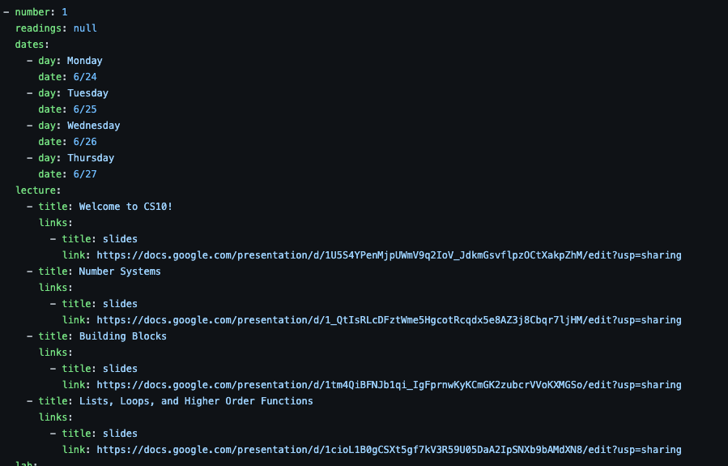
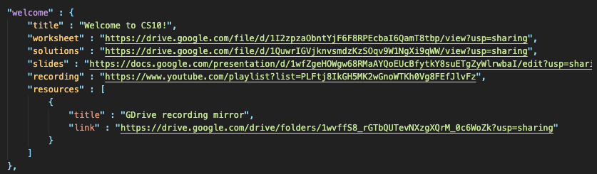
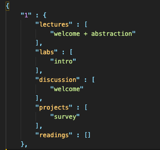

# Project Background

Here, we'll talk about the issues with previous iterations of the CS10 website, and how this current iteration of the website aims to solve these issues.

## A Brief History of CS10 websites

You can take a look at all the previous iterations of the CS10 website (oldest to newest):

1. [Spring 2019](https://cs10.org/sp19/)
2. [Summer 2019](https://cs10.org/su19/)
3. [Summer 2020](https://cs10.org/su20/)
4. [Current](https://maxsonyang.github.io/cs10-react/)

From face value, the older websites dealt with issues such as poor prioritization of content, outdated look/feel, and difficulty with accessing relevant content for students. As a student, you would literally have the whole course thrown at you, and it would be your job to figure out what you cared about.

In the backend, years of hacky solutions thrown atop hacky solutions + a lack of documentation, made the website *very painful* to work with, and often resulted in errors or unintended side effects. As a head TA, you could also expect to spend several hours before the start of the semester just to make sure things were (hopefully) working properly.

## Design Goals of the New Website

The new website seeks to accomplish the following:

- Reduce clerical errors with content, and make content reusable across semesters
- Reduce/eliminate the need for TAs to touch source code when making changes to the website.
- Prioritize delivering relevant content and reduce navigation for students
- Responsive Design

### Reusable, flexible content

#### Problem 1: Big YMLs

In the past, semester content in CS10 was encoded in a single YAML file that was *quite* large. Furthermore, this file would need to be completely rebuilt each semester because of the changes in timeframe and content organization.

    

    One section of the first week of CS10 Summer 2019, see the whole thing <a href="./big-yaml.yml">here.</a>

#### Solution: Separate the Content from the Semester

The key realization to solving this issue is that the timeframe of content is separate from the content itself. For example, a changing the release date of a homework assignment does not change the homework assignment itself. Instead of organizing the semester as one contiguous file, we can store them separately. Furthermore, any relevant dates can be calculated programmatically as long as we know the start and end of a particular semester.

Starting from the Summer 2020 version of the website, the organization of files in two general components:

1. Course Data, which contains content metadata such as labels and links.
2. Content Structure, which defines how the course data will be organized in a given semester.

Example of discussion metadata being stored.

    

Example of Week 1 of CS10 from Fall 2020

    

This new schema affords two key benefits:

1. Reorganizing content is significantly easier, just move the content to the week you'd like. Adding and updating links doesn't run the risk of affecting the organization of an entire semester's content.

2. Content is reusable, meaning for any changes in subsequent semester, you simply move around content, otherwise you can continuously reuse the same template.

#### Problem 2: Inflexible UI Logic

While courses have an incentive to maintain consistency, there are still situations where content is adjusted, and the interface must be built to match. In the summer 2020 website, this was done to an extent by configuring links and icons that would allow for programmatic rendering of the relevant links. However, each type of content (e.g. labs, lectures, etc) required their own custom logic despite having, generally, the same pattern.

#### Solution: Store UI configuration as Data

Although still a work in progress, the general idea behind this solution is to store definitions and rules on how the website's UI should be configured. This can range from which pages are included in the navigation bar, to how and which links to render for content.
